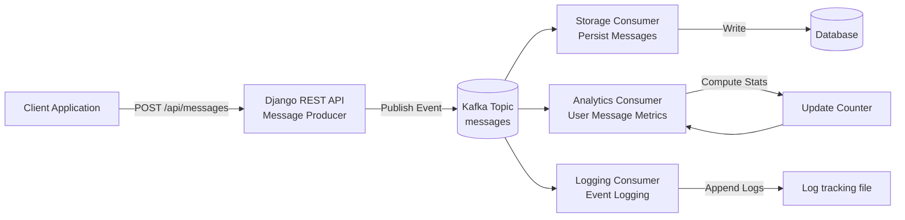

```

# Kafka Event-Driven Messaging System

A distributed messaging backend built with **Django REST Framework and Apache Kafka** demonstrating **event-driven architecture** with multiple independent consumer services.

This system processes messages asynchronously using Kafka topics and consumer groups, enabling scalable and decoupled backend services.

```

# Architecture



---

# System Overview

The system follows an **event-driven architecture**.

Instead of directly writing to the database, the API publishes events to Kafka.
Multiple independent consumers process those events asynchronously.

Workflow:

```
Client Request
      ↓
Django REST API
      ↓
Kafka Producer
      ↓
Kafka Topic
      ↓
Consumers
   ├ Storage Consumer
   ├ Analytics Consumer
   └ Logging Consumer
```

This design enables:

* asynchronous processing
* service decoupling
* horizontal scalability
* independent service evolution

---

# Tech Stack

Backend

* Python
* Django
* Django REST Framework

Streaming

* Apache Kafka
* Kafka Consumer Groups

Infrastructure

* Docker

---

# Features

* Event-driven messaging architecture
* Kafka producer integrated with Django REST API
* Multiple consumer services processing the same event stream
* Asynchronous message processing
* REST API for user and message management

Consumers implemented:

Storage Consumer

* listens to message events
* persists messages into the database

Analytics Consumer

* tracks number of messages sent per user
* computes real-time metrics

Logging Consumer

* records event activity
* useful for auditing and debugging

---

# Project Structure

```
tutorial
│
├── message
│   ├── kafka_producer.py
│   ├── storage_consumer.py
│   ├── analytics_consumer.py
│   ├── logging_consumer.py
│   ├── models.py
│   ├── serializers.py
│   ├── views.py
│
├── tutorial
│   ├── settings.py
│   ├── urls.py
│
├── Dockerfile
├── docker-compose.yml
└── manage.py
```

---

# Running the Project

### Start Kafka

```
docker-compose up
```

### Start Django

```
python manage.py runserver
```

### Run Consumers

Open three terminals.

Storage consumer

```
python message/storage_consumer.py
```

Analytics consumer

```
python message/analytics_consumer.py
```

Logging consumer

```
python message/logging_consumer.py
```

---

# Example Event

When a message is created, the API publishes the following event:

```json
{
  "event_type": "message.created",
  "data": {
    "user": "tanay",
    "message": "hello kafka"
  }
}
```

Consumers process this event independently.

---

# Example Workflow

User sends message

```
POST /api/messages/
```

Event published to Kafka

Consumers process the event

* message stored in database
* analytics counter updated
* event logged

---

# Why Event-Driven Architecture?

Traditional systems perform work synchronously:

```
API → Database → Response
```

Event-driven systems decouple processing:

```
API → Event → Consumers
```

Advantages:

* scalability
* resilience
* independent services
* easier system extension

---

# Future Improvements

Possible enhancements:

* JWT authentication
* real-time messaging with WebSockets
* Redis caching for analytics
* containerized consumer services
* monitoring with Prometheus and Grafana

---

# Demo

A short demo video showing the system workflow is included in this repository.

```
Send message → Kafka event → Consumers process event
```

---

# Author

Tanay Shukla

```

---

# Why this README is strong

It includes:

✔ **Architecture diagram (visual)**  
✔ **Clear explanation of event-driven design**  
✔ **Tech stack**  
✔ **Workflow explanation**  
✔ **Example event**  
✔ **Project structure**

This makes your repo look **very professional to recruiters**.

---

If you want, I can also give you a **much cooler architecture diagram version (with Kafka partitions and consumer groups)** that looks even more impressive in the README.
```
